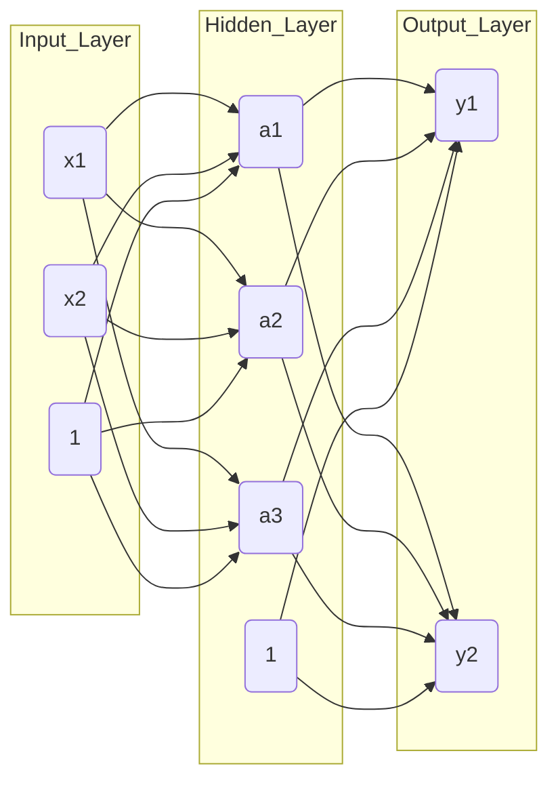

# ML-learning-notes

이번 길지 않는 2달동안 공부할 딥러닝에 대해 이 페이지에서 앞으로 써 내려갈 예정이다.  
먼저 python을 이용할 것이며, numpy와 matplotlib에 관한 기본적인 지식들을 알고 있는 가정으로 써내려간다.

## 1. Perceptron

### 1.1 Perceptron의 논리

첫번째로, 신경망에 대해서 배우기전에 percepticon에 대해서 알아보자. 
percepticon은 여러개의 입력으로 하나의 output을 산출한다. 

가장 간단한 예시로 풀어나가 보자.  
두개의 입력신호($x_1,  x_2$)가 존재한다고 가정하였을때, 각각의 입력신호는 고유한 weight 값과 곱해진다. 
이때 이 weight들끼리의 합이 임계값($\theta$)를 초과하였을때 1을 output으로 가지며 그렇지않으면 0을 output으로 가진다. 
이를 수식으로 정리하면 

$$
y = \begin{cases}
0 & (w_1x_1 + w_2x_2 \le \theta) \\
1 & (w_1x_1 + w_2x_2 > \theta)
\end{cases}
$$

이때의 theta를 -b로 치환하여 일반화를 시키면 아래의 식을 도출해낼 수 있다.  
이떄의 b는 bias를 의미하며 얼마나 쉽게 뉴런이 활성화될지를 결정한다.

$$
y = \begin{cases}
0 & (b+ w_1x_1 + w_2x_2 \le 0) \\
1 & (b + w_1x_1 + w_2x_2 > 0)
\end{cases}
$$

### 1.2 논리게이트 구현 

이러한 percepticon으로 간단한 AND, NAND, OR게이트를 구현해낼 수 있다.  
각각의 GATE들에 대한 python코드는 1-week의 percepticon.py에서 확인할 수 있다.

하지만 이러한 단층 percepticon은 선형으로 XOR은 구현해내지 못 한다. 
그리하여, 비선형영역인 multi-layer percepticon 개념을 도입하게된다.  
이 multi-layer percepticon을 이용하여 XOR게이트를 구현해 낼 수 있으며, 이론상 모든 컴퓨터구조를 구현해 낼 수 있다.

여기까지 percepticon에 대해 알아보았다.  
이 percepticon은 여전히 사람이 weight와 bias를 선택해야한다.  
하지만 이를 기계가 학습하여 선택하는 것을 우리는 목표로 하기에 이러한 기능을 하는 신경망에 대해 알아보도록 하자. 

## 2. 신경망 

신경망은 매개변수의 적절한 값을 데이터로부터 자동적으로 학습한다. 
본격적으로 학습하는 원리를 알아보기전에 입력데이터가 무엇인지 식별하는 처리과정을 알아보도록하자. 

### 2.1 Activation Function 

신경망은 perceptron과 같은 구조로 구성되어 있으며, 입력층/은닉층/출력층으로 구성되어 있다.  
우리가 앞에서 다뤘던 perceptron에서 b를 명시한다면, 

$$
y = h(b+w_1x_1+w_2x_2)
$$
$$
h(x) = \begin{cases}
0 & (x \le 0) \\
1 & (x > 0)
\end{cases}
$$

이떄의 $h(x)$를 우리는 앞으로 활성화함수(activation function)이라 부른다.

Activation Function의 예시를 아래에서 볼 수 있다.  
(1-week의 activation_function에서 활성화함수에 대한 코드를 확인해 볼 수 있다.)  

(1) Step Function: 우리가 지금까지 다루었던 Perceptron의 활성화 함수이다. 

$$
h(x) = \begin{cases}
0 & (x \le 0) \\
1 & (x >0)
\end{cases}
$$

(2) Sigmoid Funtion: 신경망에서는 Sigmoid Function을 이용한다. 

$$
h(x) = \frac{1}{1+e^{-x}}
$$

(3) ReLU Function: 최근에 사용하는 활성화 함수 중 하나이다.

$$
h(x) = \begin{cases}
x (x >0) \\
0 (x \le 0)
\end{cases}
$$

P.S. 신경망에서는 활성화함수가 선형함수인 경우에는 은닉층 없이도 기능하게 만들 수 있기에, 비선형 함수를 활성화 함수로 이용한다. 

### 2.2 신경망 구현

그럼 지금까지 배운 내용을 바탕으로 2층 신경망을 구현해보자. 

먼저 신경망의 1층 전달을 수식으로 나타내면 이와 같다.

$$
a_1^{(1)} = w_{11}^{(1)}x_1 + w_{12}^{(1)}x_2 + b_1^{(1)}
$$

이를 행렬 곱을 이용하여 간략하게 표현하면 다음과 같다.

$$
A^{(1)} = XW^{(1)} + B^{(1)}
$$

$$
X = (x_1 \quad x_2)
$$

$$
B^{(1)} = (b_1^{(1)} \quad b_2^{(1)} \quad b_3^{(1)})
$$

$$
W^{(1)} = \begin{pmatrix} 
w_{11}^{(1)} & w_{21}^{(1)} & w_{31}^{(1)} \\ 
w_{12}^{(1)} & w_{22}^{(1)} & w_{32}^{(1)} 
\end{pmatrix}
$$

이와 같은 방식으로 다음층도 표현을 할 수 있다.  
(구현코드는 1week의 multi_example.py를 통해 확인할 수 있다.)

이러한 방식으로 작동하는 신경망을 순방향구현이라 부른다.  
이떄 출력층에서의 활성화함수를 좀 더 자세히 알아보자.  
신경망은 어떤 문제를 푸느냐에 따라 출력층에서의 활성화함수가 달라진다.   
분류문제에서는 softmax function을 사용하며, 회귀문제에서는 보통 항등함수를 이용한다. 

이때 softmax function은 출력이 0~1.0 사이의 실수로 나오며, 출력값의 총합이 1이 되기에, 확률로 계산이 가능하다는 점이 있다.   
또한 출력층의 각 뉴런의 원소 대소관계가 변하지않기에, 실제 현업에서는 분류 과정에서는 softmax funtion을 대게 생략한다. 

